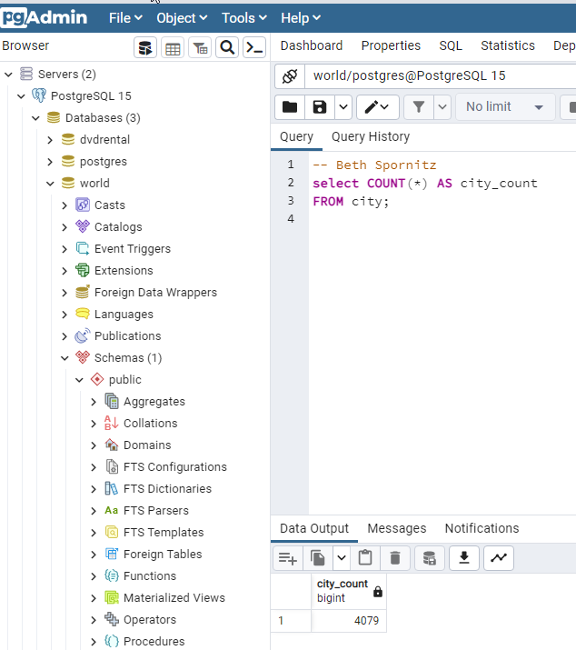
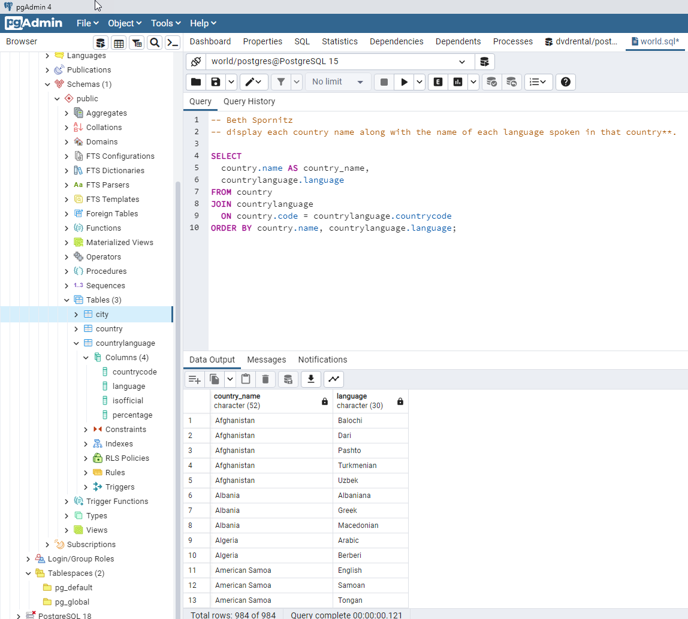
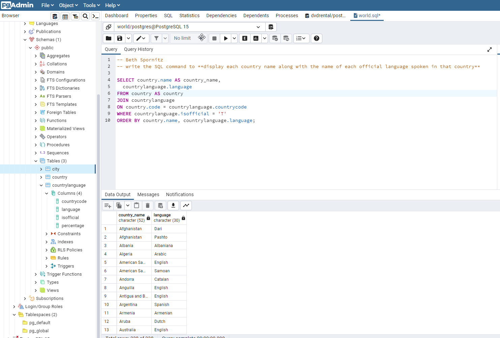
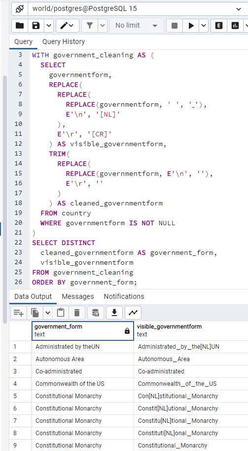
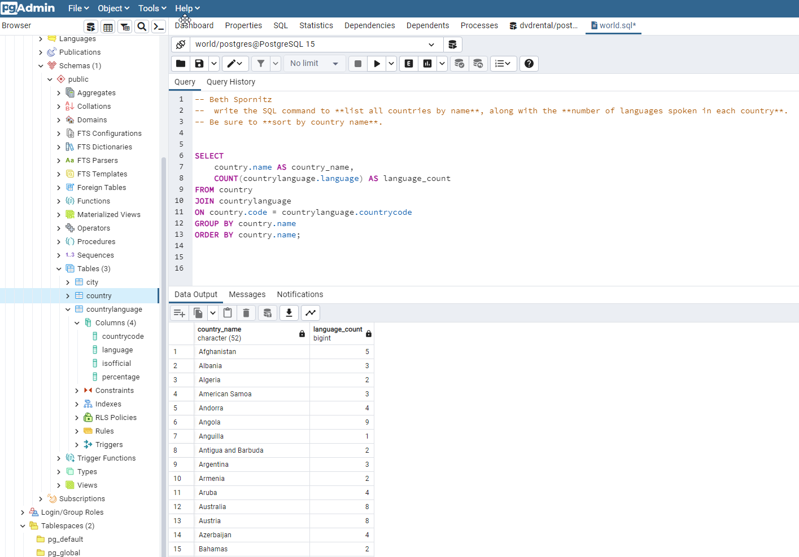
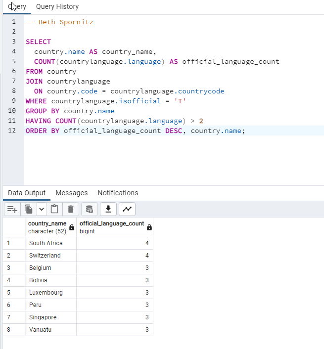
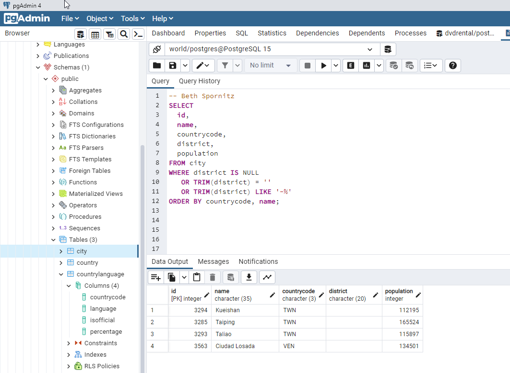
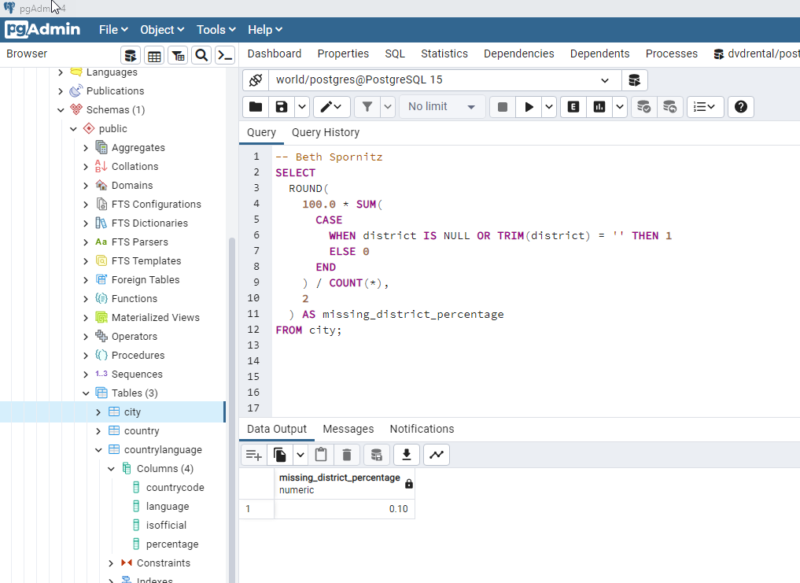

# Exercise 02: World Database – Joins, Grouping, and Data Quality

- Name:  Beth Spornitz
- Course: Database for Analytics
- Module: 2
- Database Used: World Database (PostgreSQL)

---

## Instructions

- Answer each question below using SQL executed against the **World database**.
- All SQL commands **must be run by you**.
- For each SQL-based question:
  - Include the SQL command in a fenced code block
  - Include a **screenshot** showing the command and its results
- Store screenshots in the `screenshots/` folder and embed them below each answer.

---

## Question 1

When importing records from `worldPGSQL.sql`, **how many cities were imported**?

### Answer
4079

### Screenshot
_Show evidence of how you determined this (for example, a COUNT query)._

```sql
SELECT COUNT(*) AS city_count
FROM city;
```



---

## Question 2

Using the World database, write the SQL command to **display each country name along with the name of each language spoken in that country**.

### SQL

```sql
SELECT
  country.name AS country_name,
  countrylanguage.language
FROM country
JOIN countrylanguage
  ON country.code = countrylanguage.countrycode
ORDER BY country.name, countrylanguage.language;
```

### Screenshot



---

## Question 3

Using the World database, write the SQL command to **display each country name along with the name of each official language spoken in that country**.

### SQL

```sql
SELECT country.name AS country_name,
  countrylanguage.language
FROM country AS country
JOIN countrylanguage
ON country.code = countrylanguage.countrycode
WHERE countrylanguage.isofficial = 'T'
ORDER BY country.name, countrylanguage.language;
```

### Screenshot



---

## Question 4

Consider the following two SQL statements:

```sql
SELECT *
FROM country, countrylanguage
WHERE country.code = countrylanguage.countrycode;
```

```sql
SELECT *
FROM country
LEFT OUTER JOIN countrylanguage
ON country.code = countrylanguage.countrycode;
```

**In your own words**, describe what data the **second query returns that the first query does not**.

### Answer
What the second query returns that the first query does not is all countries regardless of whether or not they have a matching language record.  In the 2nd query, instead of getting rid of the rows without a matching language record, all countries are displayed and the language will be NULL.

---

## Question 5

Using the World database, write the SQL command to **list all different forms of government** found in the data.
Do **not** repeat any form of government more than once.

### SQL

```sql
SELECT DISTINCT country.governmentform
FROM country;
```

The shorter code yielded output that looked like there were duplicates.  I don't think the intent was for us to try to clean the data inside SQL, so instead the code below does the same thing, but it shows the spaces and line breaks that you can't see normally.

```sql
WITH government_cleaning AS (
  SELECT
    governmentform,
    REPLACE(
      REPLACE(
        REPLACE(governmentform, ' ', '␣'),
        E'\n', '[NL]'
      ),
      E'\r', '[CR]'
    ) AS visible_governmentform,
    TRIM(
      REPLACE(
        REPLACE(governmentform, E'\n', ''),
        E'\r', ''
      )
    ) AS cleaned_governmentform
  FROM country
  WHERE governmentform IS NOT NULL
)
SELECT DISTINCT
  cleaned_governmentform AS government_form,
  visible_governmentform
FROM government_cleaning
ORDER BY government_form;
```

### Screenshot



---

## Question 6

Using the World database, write the SQL command to **list all names of cities and countries in one column**.
Label the column **"City or Country Name"**.

### SQL

```sql
SELECT name AS "City or Country Name"
FROM city
UNION
SELECT name AS "City or Country Name"
FROM country
ORDER BY "City or Country Name";

```

### Screenshot


---

## Question 7

Using the World database, write the SQL command to **list all countries by name**, along with the **number of languages spoken in each country**.
Be sure to **sort by country name**.

### SQL

```sql
SELECT
	country.name AS country_name,
	COUNT(countrylanguage.language) AS language_count
FROM country
JOIN countrylanguage
ON country.code = countrylanguage.countrycode
GROUP BY country.name
ORDER BY country.name;
```

### Screenshot



---

## Question 8

Using the World database, write the SQL command to **list all languages**, along with the **number of countries where each language is spoken**.
Be sure to **sort by language name**.

### SQL

```sql
SELECT
  countrylanguage.language,
  COUNT(DISTINCT countrylanguage.countrycode) AS country_count
FROM countrylanguage
GROUP BY countrylanguage.language
ORDER BY countrylanguage.language;
```

### Screenshot


---

## Question 9

Using the World database, write the SQL command to **list countries that have more than two official languages**, along with the **number of official languages spoken**.

*Hint: There are 8 such countries in this dataset.*

### SQL

```sql
-- Your SQL here
```

### Screenshot



---

## Question 10

Using the World database, write the SQL command to **find cities where the district value is missing**.

*Hint: Use `LIKE` and the dash (`-`) since some rows use that instead of actual data.*

### SQL

```sql
-- Your SQL here
```

### Screenshot



---

## Question 11

Using the World database, write the SQL command to **calculate the percentage of cities with missing district values**.

*Hint: The result should be approximately 0.4%.*

### SQL

```sql
-- Your SQL here
```

### Screenshot


