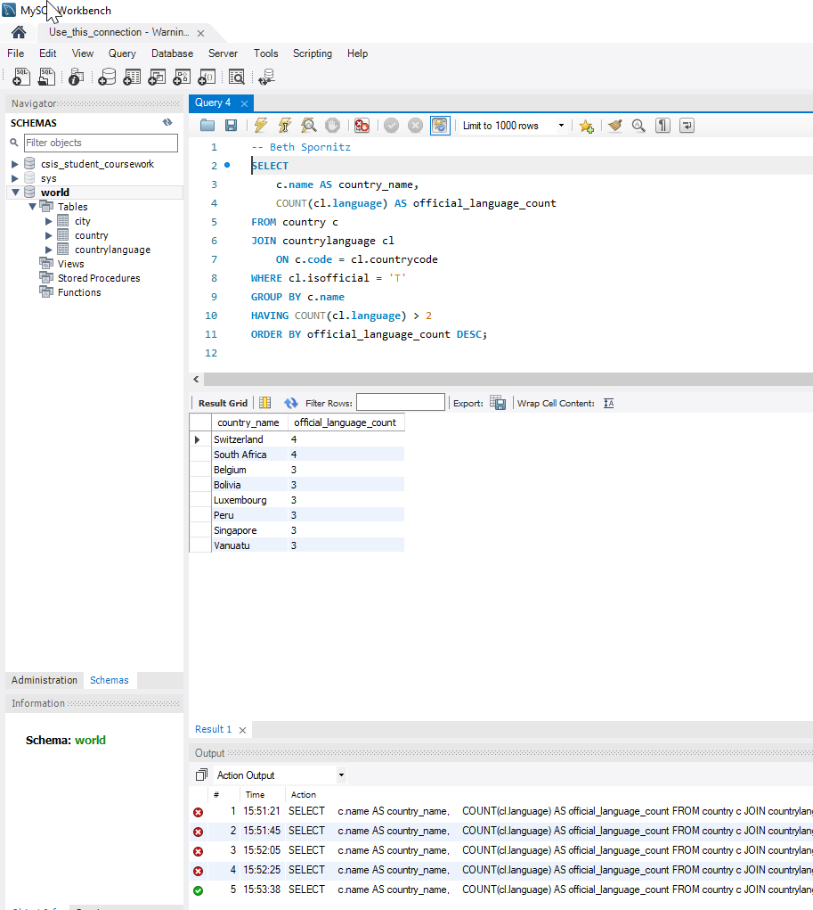
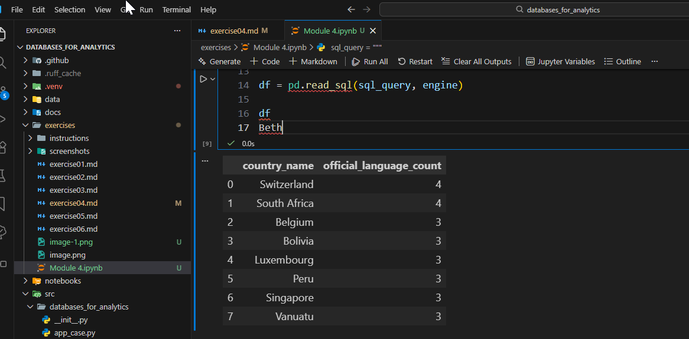
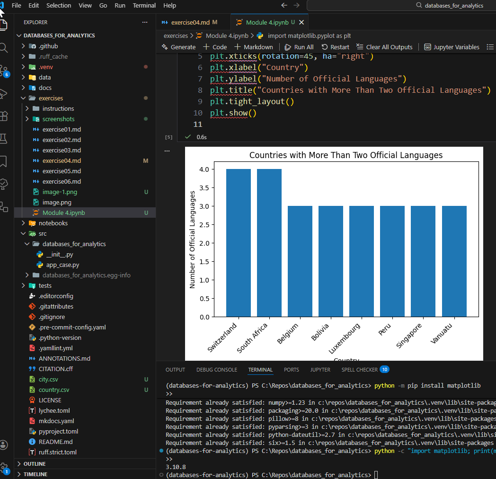

# Exercise 04: Advanced SQL, Jupyter, and Visualization

- Name:  Beth Spornitz
- Course: Database for Analytics
- Module:  4
- Database Used: World Database
- Tools Used: PostgreSQL, SQLAlchemy, Pandas, Jupyter Notebooks

---

## Instructions

- Complete each task using the **World database** installed earlier.
- For SQL questions:
  - Write the SQL command in a fenced code block
  - Execute the command and include a **screenshot of the results**
- For Jupyter Notebook questions:
  - Include the required Python statements
  - Include **screenshots of the notebook output**
- Store all screenshots in the `screenshots/` folder and embed them below each question.

---

## Question 1

Considering the World database, write a SQL statement that will **display the names of countries that speak more than two official languages**, along with the **number of official languages spoken**.

- Sort the results by **number of languages**, from **most to least**.
- *Hint: There are fewer than 10 countries in the results.*

### SQL

```sql
SELECT
    c.name AS country_name,
    COUNT(cl.language) AS official_language_count
FROM country c
JOIN countrylanguage cl
    ON c.code = cl.countrycode
WHERE cl.isofficial = 'T'
GROUP BY c.name
HAVING COUNT(cl.language) > 2
ORDER BY official_language_count DESC;
```

### Screenshot



---

## Question 2

Using **Jupyter Notebooks**, you must use the `create_engine` command to connect to your database.

After the `create_engine` command is executed, **what are the three statements required to execute the query from Question 1 and display the results in the notebook**?

### Python Code

```python
sql_query = """
SELECT
    c.name AS country_name,
    COUNT(cl.language) AS official_language_count
FROM country c
JOIN countrylanguage cl
    ON c.code = cl.countrycode
WHERE cl.isofficial = 'T'
GROUP BY c.name
HAVING COUNT(cl.language) > 2
ORDER BY official_language_count DESC;
"""

df = pd.read_sql(sql_query, engine)

df
```

### Screenshot



---

## Question 3

Using **Jupyter Notebooks**, write the Python code needed to produce the following graph:


(The graph shows country-level results derived from the World database.)

### Python Code

```python
import matplotlib.pyplot as plt

# Rename columns to match instructor output
df_plot = df.rename(columns={
    "country_name": "name",
    "official_language_count": "num_languages"
})

# Sort to match visual order
df_plot = df_plot.sort_values(by="num_languages", ascending=False)

plt.figure(figsize=(6, 4))
plt.bar(df_plot["name"], df_plot["num_languages"], label="num_languages")
plt.xticks(rotation=90)
plt.xlabel("name")
plt.legend()
plt.tight_layout()
plt.show()
```

### Screenshot


